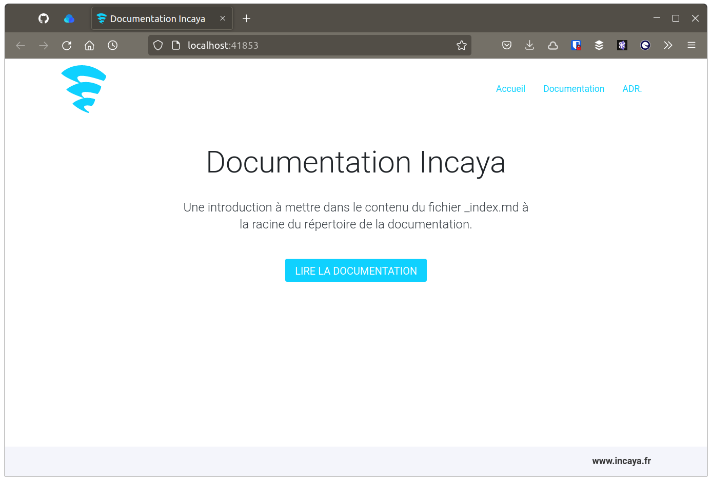

# Incaya Documentation

Ce dépôt contient le code permettant de générer une image Docker contenant l'outillage de base que nous utilisons pour maintenir la documentation de nos projets, c'est-à-dire :

- [Hugo](https://gohugo.io/), un générateur statique de code, permettant d'afficher en HTML les fichiers de documentation écrits en `markdown`.
- Un [archetype](https://gohugo.io/content-management/archetypes/) Hugo permettant de générer des [ADRs](https://adr.github.io/).
- Des scripts permettant de générer facilement un document ou un ADR.
- Un thème basique basé sur [Hugo Whisper](https://github.com/zerostaticthemes/hugo-whisper-theme)
- Une instance d'[Excalidraw](https://github.com/excalidraw/excalidraw) pour réaliser nos schémas. 



## Principe de fonctionnement

**L'objectif principal d'`incaya-documentation` est de rendre facilement et rapidement accessible - à la lecture, mais aussi à l'écriture - la documentation de nos projets.**

À cette fin, cette documentation est réalisée en [markdown](https://docs.framasoft.org/fr/grav/markdown.html) dans un répertoire dédié de la base de code, proche du développeur donc. Ainsi, la documentation est directement accessible depuis Github par exemple. 

Mais pour la rendre encore plus facilement lisible, on va utiliser [Hugo](https://gohugo.io/) pour l'afficher directement dans l'environnement de développement. Hugo est un générateur de code statique qui va se charger d'afficher en HTML des fichiers `.md` contenus (et organisés) au sein d'un répertoire `content`. 

L'utilisation basique de l'image `incaya-documentation` va donc simplement consister à monter le répertoire stockant la documentation du projet dans un répertoire `content` du conteneur Docker.

Nous sommes aussi convaincus qu'une bonne documentation d'un projet informatique se doit d'inclure des schémas (d'architecture, d'infrastructure ...). Et nous aimons particulièrement la simplicité et l'efficacité d'[Excalidraw](https://github.com/excalidraw/excalidraw) pour réaliser de tel schéma. Il est donc inclus dans l'image Docker en plus de Hugo.

## Utilisation avec Docker

> Il existe deux versions de l'image docker : une avec des contenus en français `ghcr.io/incaya/incaya-documentation:fr` et l'autre en anglais `ghcr.io/incaya/incaya-documentation:en`. Selon la langue avec laquelle vous souhaitez gérer votre documentation, pensez à utiliser la bonne image !
> Pour les exemples à suivre, on utilise la version française de l'image, qui est celle par défaut.

Soit un projet dont la documentation est contenue dans le répertoire `documentations` organisé de la manière suivante :

```bash
documentations
├── adrs
│   └── adr1.md
└── docs
    └── doc1.md
```

> La présence des répertoires `adrs` et `docs` correspond à notre organisation par défaut de la documentation, mais aussi aux menus générés par la configuration d'Hugo. Cela peut être modifié en surchargent cette configuration par défaut, voir la suite "Surchager la configuration"

On lance alors `incaya-documentation` de la maniére suivante :

```bash
docker run --rm --name project-documentation -d \
	-v documentations:/documentation/content \
	-p 3000:3000 \
	-p 1313:1313 \
	ghcr.io/incaya/incaya-documentation:fr
```

Hugo peut aussi utiliser des fichiers spécifiques pour gérer les pages d'accueil (accueil général, accueil documentation, accueil ADR). Vous pouvez générer ses fichiers en ligne de commande depuis le conteneur :

```bash
➜  docker exec -it project-documentation bash
root@27f70055675c:/# cd documentation/
root@27f70055675c:/documentation# ./init-doc.sh 
Le répertoire de documentation est bien présent.
La documentation est maintenant initialisée.
root@27f70055675c:/documentation# exit
```

Le site de documentation est alors visible sur http://localhost:1313

Excalidraw est accessible sur http://localhost:3000

## Utilisation avec Docker Compose

Bien évidement, la documentation peut être intégrée avec Docker Compose :

```yaml
version: "3.7"

services:
  documentation:
    image: ghcr.io/incaya/incaya-documentation:fr
    volumes:
      - ./documentations:/documentation/content
    ports:
      - 3000:3000
      - 1313:1313
```

Et voici une recette pouvant être ajoutées à un `Makefile` :

```makefile
# in Makefile
doc-init: # Setup documentation folder
	docker-compose run --rm --no-deps documentation bash -ci '\
		cd /documentation && \
		./init-doc.sh \
	'
```

## Générer des documents

Hugo utilise les [`front matter`](https://gohugo.io/content-management/front-matter/) présents dans les fichiers `.md`, entre autres la propriété `weight` pour gérer l'ordre des articles.

Il existe un script permettant de générer un nouveau fichier `md` de documentation avec le front matter prérempli : `new-docs.sh`. 

De la même manière, il existe un script permettant de créer un nouvel ADR : `new-docs.sh`.

Voici comment les intégrer dans un `Makefile` :

```makefile
# in Makefile
doc-new-adr: ## Create a new ADR
	docker-compose run --rm --no-deps documentation bash -ci '\
		cd /documentation && \
		./new-adr.sh \
	'
doc-new-doc: ## Create a new file for documentation
	docker-compose run --rm --no-deps documentation bash -ci '\
		cd /documentation && \
		./new-docs.sh \
	'
```

## Surchager la configuration

L'image Docker est fournie avec une configuration par défaut de Hugo. Cette configuration permet entre autres de définir les menus de site. Il est possible de remplacer cette configuration par défaut par une configuration propre au projet en cours, par exemple dans un fichier `hugo-config.toml` :

```toml
baseURL = "http://localhost"
languageCode = 'en'
defaultContentLanguage = 'en'
title = "My Documentation"

pygmentsCodeFences = true
pygmentsCodefencesGuessSyntax = true
pygmentsUseClasses = true

# Controls how many words are printed in the content summary on the docs homepage.
# See https://gohugo.io/content-management/summaries/
summaryLength = 30

[[menu.main]]
    name = "Accueil"
    url = "/"
    weight = 1

[[menu.main]]
    name = "Documentation"
    url = "/docs/"
    weight = 2

[[menu.main]]
    name = "ADR."
    url = "/adrs/"
    weight = 3

[[menu.main]]
    name = "Search"
    url = "/search/"
    weight = 4

[params]
  google_analytics_id=""
  homepage_button_link = 'adrs'
  homepage_button_text = 'see adrs'
  enable_anchor_link = true
  mainSections = ['docs', 'adrs', 'search']
  footer_link_url = 'https://www.mydomaine/'
  footer_link_title = 'mydomaine'

  [params.logo]
      standard  = "images/mylogo.png"
```

Il suffit alors de monter se fichier dans le conteneur Docker, par exemple avec Docker Compose ou l'on change aussi le port de Hugo en `6666` et le port exposé de Excalidraw en `6667`:

```yaml
version: "3.7"

services:
  documentation:
    image: ghcr.io/incaya/incaya-documentation:en
    volumes:
      - ./documentations:/documentation/content
      - ./logo.png:/documentation/static/images/mylogo.png
      - ./hugo-config.toml:/documentation/config.toml
    environment:
      - HUGO_PORT=6666
    ports:
      - 6666:6666
      - 6667:3000
```

## Publication

Si l'objectif principal est d'afficher la documentation en environnement de développement, rien n'empêche de profiter d'Hugo pour générer des fichiers statiques de la documentation, pour ensuite les héberger sur un service du type Github Pages ou Netlify.

Hugo générant les fichiers finaux dans un répertoire `public` :

```yaml
version: "3.7"

services:
  documentation:
    image: ghcr.io/incaya/incaya-documentation:fr
    volumes:
      - ./documentations:/documentation/content
      - ./doc-public:/documentation/public
      - ./hugo-config.toml:/documentation/config.toml
    ports:
      - 3000:3000
      - 1313:1313
```

```makefile
# in Makefile
doc-generate: ## Generate statics for documentation ready for publication
	docker-compose run --rm --no-deps documentation bash -ci '\
		cd /documentation && \
		hugo \
	'
```


## Mainteneur

[](https://github.com/alexisjanvier)
[Alexis Janvier](https://github.com/alexisjanvier)

## License

incaya-documentation est sous licence [Apache](LICENSE), avec la permission [d'Incaya](https://www.incaya.fr).
